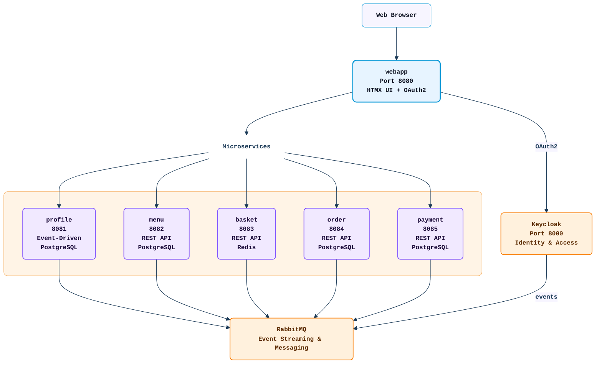

# Foodies

A microservices-based food ordering application built with Kotlin and Ktor. The system uses Keycloak for authentication,
RabbitMQ for event streaming, PostgreSQL for data persistence, and Redis for caching.

## Architecture Overview



## Modules

```
foodies/
├── webapp/                      # Main web application
├── menu/                        # Menu microservice
├── basket/                      # Basket microservice
├── profile/                     # Profile microservice
├── order/                       # Order microservice (in development)
├── payment/                     # Payment microservice (in development)
├── server-shared/               # Shared server utilities
├── server-shared-test/          # Shared test helpers
├── events/                      # Event definitions
│   ├── events-common/           # Shared event types
│   ├── events-user/             # User events
│   ├── events-order/            # Order events
│   ├── events-payment/          # Payment events
│   └── events-menu/             # Menu events
├── keycloak-rabbitmq-publisher/ # Custom Keycloak provider for RabbitMQ
├── rabbitmq-ext/                # RabbitMQ extensions
├── e2e/                         # End-to-end tests
├── k8s/                         # Kubernetes manifests
├── docs/                        # Documentation
```

## Technology Stack

| Category       | Technology                               |
|----------------|------------------------------------------|
| Language       | Kotlin (JDK 21)                          |
| Framework      | Ktor 3.3.3                               |
| Build          | Gradle with Kotlin DSL, Version Catalogs |
| Database       | PostgreSQL 18, Redis 8                   |
| ORM            | Exposed v1                               |
| Migrations     | Flyway                                   |
| Messaging      | RabbitMQ 4.2                             |
| Authentication | Keycloak 26.5 (OAuth2/OIDC)              |
| Frontend       | HTMX 1.9.12, kotlinx.html                |
| Testing        | TestBalloon, Testcontainers, Playwright  |
| Observability  | OpenTelemetry, Prometheus                |
| Deployment     | Docker Compose, Kubernetes (Kustomize)   |

## Quick Start

### Prerequisites

- JDK 21
- kubectl (1.14+ for kustomize)

### 1. Build and publish images

See [k8s/README.md](k8s/README.md) for detailed deployment instructions.

```bash
./gradlew publishImageToLocalRegistry
kubectl apply -k k8s/overlays/dev
```

#### Access the Application

- Username: `food_lover@gmail.com`
- Password: `password`

This setup assumes '127.0.0.1 foodies.local' in /etc/hosts

- **Web App**: http://foodies.local
- **Keycloak Admin**: http://foodies.local/auth (admin/admin)

## Documentation

- [Project Setup Guide](docs/PROJECT_SETUP.md) - Ktor server setup best practices
- [Security Guidelines](docs/SECURITY.md) - Security best practices and guidelines
- [Kubernetes Deployment](k8s/README.md) - Detailed Kubernetes deployment instructions

### Service Documentation

- [WebApp](webapp/README.MD)
- [Menu](menu/README.MD)
- [Basket](basket/README.md)
- [Profile](profile/README.MD)
- [Order](order/README.md)
- [Payment](payment/README.md)

### Event Documentation

- [User Events](events/events-user/README.MD)

## Architecture Patterns

All services follow consistent architectural patterns documented below. Service-specific READMEs focus on their unique API, configuration, and domain logic.

### Manual Dependency Injection

Dependencies are wired explicitly in `Module` classes (e.g., `MenuModule`, `BasketModule`) without a DI framework, promoting clear understanding of application structure and explicit dependency graphs.

### Layered Architecture

```
Routes (HTTP) → Service (Business Logic) → Repository (Data Access) → Database
```

Each layer has clear responsibilities:
- **Routes**: HTTP endpoint definitions, request/response handling, authentication
- **Service**: Business logic, validation, orchestration
- **Repository**: Data access, database operations
- **Database**: PostgreSQL (persistent data) or Redis (cache/sessions)

### Event-Driven Communication

Services communicate via RabbitMQ events:
- **Exchange**: `foodies` (topic exchange)
- **Idempotent Operations**: Events are designed to be safely reprocessed
- **Manual Ack/Nack**: Explicit acknowledgment for reliable processing
- **Event Types**: Defined in `events/` modules (`events-user`, `events-order`, `events-payment`, `events-menu`)

### Configuration Pattern

All services use a consistent configuration approach:
- Configuration loaded from `src/main/resources/application.yaml`
- Environment variable overrides for all settings
- Common variables: `HOST`, `PORT`, `DB_URL`, `RABBITMQ_HOST`, `OTEL_EXPORTER_OTLP_ENDPOINT`

### Health Check Endpoints

All services expose standard health check endpoints via [Cohort](https://github.com/sksamuel/cohort):
- `GET /healthz/startup`: Service initialization status
- `GET /healthz/liveness`: Service running status
- `GET /healthz/readiness`: Ready to handle requests (includes dependency checks)

### Validation DSL

Input validation uses a consistent DSL pattern:
```kotlin
validate {
    name.validate(String::isNotBlank) { "name must not be blank" }
    price.validate({ it > BigDecimal.ZERO }) { "price must be positive" }
}
```

## Development Guidelines

This project follows specific development patterns and conventions. See [AGENTS.md](AGENTS.md) for detailed guidelines.

### Code Style
- **Structured Logging**: Tracing-based logging, never log secrets
- **Type Safety**: Proper domain modeling, avoid exceptions for control flow

### Testing
- **No Mocks**: Use TestContainers for real integration testing
- **TestBalloon**: Test framework with fixture management (see [server-shared-test](server-shared-test/README.md))
- **Comprehensive Coverage**: Unit tests for business logic, integration tests for full flows

### Build Commands

```bash
# Build any module
./gradlew :<module>:build

# Run tests for a module
./gradlew :<module>:jvmTest

# Run specific test suite
./gradlew :<module>:jvmTest --tests "*ServiceSpec*"

# Build Docker image for local registry
./gradlew :<module>:publishImageToLocalRegistry

# Build all images
./gradlew publishImageToLocalRegistry
```

## License

This project is for educational purposes.
