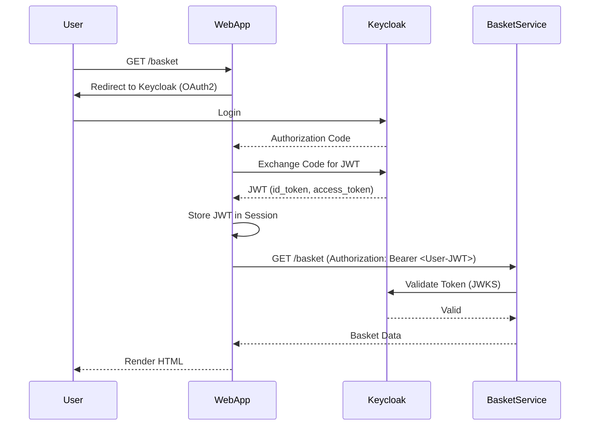
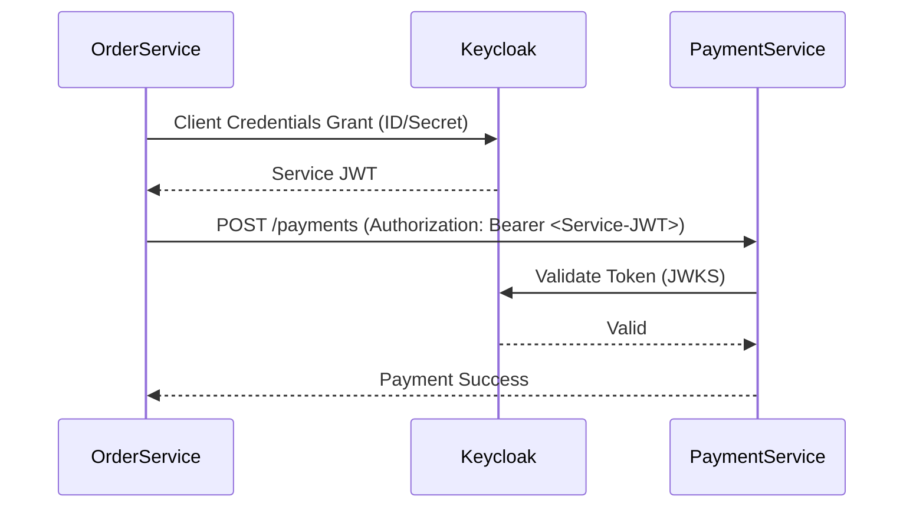

# Hybrid Authentication Architecture

This document describes the hybrid authentication architecture used in Foodies to secure communications between users and services, and among the microservices themselves.

## Overview

Foodies employs a multi-layered security approach:

1.  **User-to-Service Authentication**: Users authenticate via Keycloak (OAuth2/OpenID Connect). A JWT is issued to the web application, which is then passed to backend services.
2.  **Service-to-Service Authentication**: Services authenticate with each other using the **Client Credentials** grant flow, obtaining their own service-level JWTs.
3.  **Token Delegation**: Services can delegate user identity by exchanging a user token for a service token that includes user context, or by simply passing the user token along with a service token.

## 1. User-to-Service Auth (OAuth2/JWT)

The `webapp` acts as an OAuth2 client. Users log in through Keycloak.

### Flow
1.  User visits `/login` on `webapp`.
2.  `webapp` redirects to Keycloak.
3.  User authenticates.
4.  Keycloak redirects back to `webapp` with an authorization code.
5.  `webapp` exchanges the code for an `id_token` and `access_token`.
6.  The `id_token` is stored in a secure server-side session.
7.  Subsequent requests from the browser to `webapp` use the session cookie.
8.  `webapp` extracts the JWT and includes it in the `Authorization: Bearer <token>` header when calling backend services (e.g., `basket`, `order`).

### Backend Validation
Backend services use the `Authentication` plugin with the `jwt` provider (configured in `server-shared`) to validate these tokens.

```kotlin
// In server-shared Security.kt
suspend fun Application.security(auth: Auth, client: HttpClient) {
    val config = client.use { it.discover(auth.issuer) }
    install(Authentication) {
        jwt {
            verifier(config.jwks(), config.issuer) {
                withAudience("foodies")
            }
            validate { credential -> JWTPrincipal(credential.payload) }
        }
    }
}
```

## 2. Service-to-Service Auth (Client Credentials)

When a service needs to call another service independently of a user (e.g., a background task or event-driven update), it uses its own credentials.

### Components
- `ServiceClientConfig`: Configuration for the service client (issuer, clientId, clientSecret).
- `ServiceTokenClient`: Interface for obtaining service tokens.
- `KeycloakServiceTokenClient`: Implementation using the Client Credentials grant.
- `CachingServiceTokenClient`: Wrapper that caches tokens until they are near expiration.

### Configuration
Each service has its own client in Keycloak and corresponding secrets in Kubernetes.

```yaml
# Example secret
apiVersion: v1
kind: Secret
metadata:
  name: basket-service-credentials
data:
  client-id: <base64>
  client-secret: <base64>
```

### Usage
```kotlin
val token = serviceTokenClient.getToken()
httpClient.get(url) {
    bearerAuth(token)
}
```

## 3. Token Delegation Pattern

Token delegation is used when Service A calls Service B on behalf of a user.

### Pattern: Header Propagation
The `webapp` propagates the user's JWT to backend services. If a backend service needs to call another one, it may propagate the user token or use its own service token if the action is service-level.

### Pattern: Token Exchange (Planned)
For higher security, Service A can exchange the user's token for a specific "downstream" token via Keycloak's token exchange grant, ensuring principle of least privilege.

## Sequence Diagrams

### User-to-Service Flow



### Service-to-Service Flow



## RabbitMQ Security

Services connecting to RabbitMQ use dedicated credentials. RabbitMQ is configured with authentication and authorization to ensure only authorized services can publish or subscribe to specific exchanges and queues.

Credentials are provided via Kubernetes secrets:
- `RABBITMQ_USERNAME`
- `RABBITMQ_PASSWORD`
