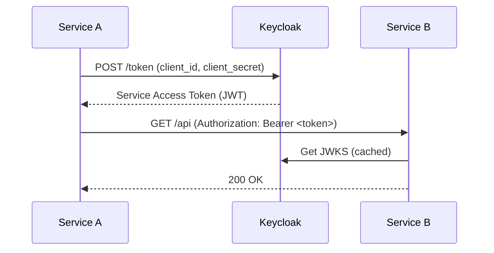

# Service-to-Service Authentication Architecture

This document describes the service-to-service (S2S) authentication and authorization patterns used in the Foodies microservices architecture.

## Overview

We use a **Dual-Token Pattern** to separate user context from service identity.

- **Service Token**: Authenticates the calling service itself.
- **User Token** (Optional): Propagates the original user's identity and permissions.

## Authentication Flow

We use the **OAuth2 Client Credentials Grant** flow for service authentication.

1. **Service A** requests a token from **Keycloak** using its `client_id` and `client_secret`.
2. **Keycloak** validates credentials and returns a **Service Access Token** (JWT).
3. **Service A** calls **Service B**, including the token in the `Authorization: Bearer <token>` header.
4. **Service B** validates the JWT using Keycloak's JWKS.



## Implementation Details

### Service Identity

Each service is registered as a confidential client in Keycloak:
- Client ID: `service-<name>` (e.g., `service-webapp`)
- Access Type: Confidential
- Service Accounts Enabled: Yes

### Token Propagation

We use a custom `AuthContext` in Ktor to manage tokens in the coroutine context.

```kotlin
sealed interface AuthContext : CoroutineContext.Element {
    data class ServiceAuth(
        val serviceToken: String,
        val userToken: String? = null
    ) : AuthContext
}
```

The `AuthContextPlugin` automatically adds the required headers to outgoing requests.

### Authorization

Authorization is handled via scopes and roles:
- **Scopes**: Define what a service can do (e.g., `basket:read`).
- **Roles**: Define user permissions (e.g., `admin`).

Use the `requireScope` helper in routing:

```kotlin
requireScope("basket:read") {
    get("/items") { ... }
}
```

## Configuration

Services are configured via `application.yaml`:

```yaml
auth:
  issuer: ${AUTH_ISSUER}
service:
  identity:
    clientId: ${SERVICE_CLIENT_ID}
    clientSecret: ${SERVICE_CLIENT_SECRET}
```

Credentials are provided via Kubernetes Secrets.
